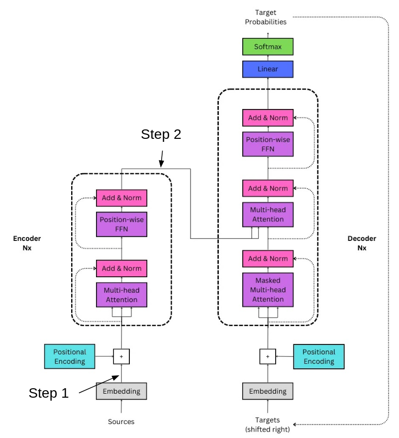

# Bart

This directory contains the key components of our exploration into the embeddings of the BART model. Here, you’ll find the source code as well as various tests and results related to our study of embeddings. Below is a detailed description of the subdirectories within this folder:

### 1. bart_source_code

+ **Description:** This folder contains the source code for the BART model (encoder and decoder). This code is not intended for direct use but rather serves as a reference to help us better understand how BART operates and how its embeddings are constructed.
+ **Objective:** We primarily use this to deepen our understanding of BART’s internal mechanisms, which aids us in interpreting our experiments more effectively.

### 2. full_embedding

+ **Description:** This folder includes the code for the initial tests conducted on BART embeddings. These tests were performed before we had a deep understanding of how a transformer works.
+ **Objective:** While these tests are somewhat basic, they provided us with a good first approach to working with embeddings. In this folder, we are working with already processed embeddings, which include positional encoding, multi-head attention and normalization.
+ **Limitations:** The tests in this folder are relatively naive and were conducted before we fully grasped the complexity of the embedding process.

### 3. rebuild_embedding

+ **Description:** This folder revisits the somes of the tests from full_embedding, but with our improved understanding of embeddings.
+ **Objective:** We decided to conduct these tests on the initial step of embedding, before the application of positional encoding and normalization. The goal is to produce potentially more accurate and insightful results. Positional encoding and normalization are added later to assess their impact.
+ **Advantages:** This approach allows us to better isolate and understand the different stages of the embedding process in BART.

### 4. inputs

+ **Description:** This folder contains a collection of documents used to test the embeddings.
+ **Objective:** To provide a consistent set of input data for conducting reproducible and comparative tests on the various embedding stages.

### 5. results

+ **Description:** This folder stores the results of certain tests performed on BART embeddings.
+ **Objective:** Although most results are not particularly relevant, they are included here to document the experiments conducted and to provide a historical record of the tests performed.

  
   
  
    Plan of Bart encoder/decoder. Image by <a href="https://medium.com/@hunter-j-phillips/overview-the-implemented-transformer-eafd87fe9589" target="_blank">Hunter Phillips</a>.
  

+ **Step 1:** Refers to the raw embeddings before any additional processing. Evaluated in the '**rebuild_embedding tests**'.
+ **Step 2:** Refers to the embeddings after positional encoding and normalization. Evaluated in the '**full_embedding tests**'.
